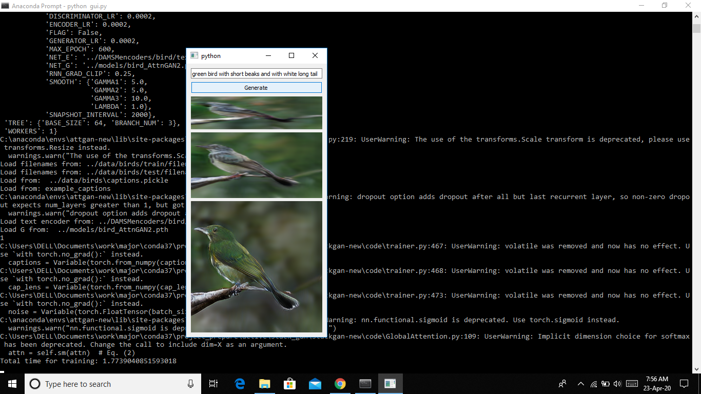

# inference_AttnGan_py3

AttnGAN is a work I found here. https://github.com/taoxugit/AttnGAN

Only the GUI section is coded by me. All other parts were converted from original codebase in Python2 to Python3 using 2to3. All the models were obtained from the official repo. Some parts has been edited to get compatible with PyTorch cpu only.

Result from the GUI:

Save the text encoder into DAMSMencoders from https://drive.google.com/open?id=1GNUKjVeyWYBJ8hEU-yrfYQpDOkxEyP3V

Save the model into models from https://drive.google.com/open?id=1lqNG75suOuR_8gjoEPYNp8VyT_ufPPig

Install packages specified in requirements.txt

Move into the directory code.

Run python gui.py

